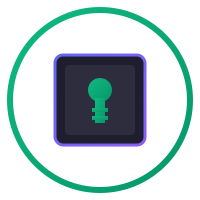

# NexusClaw

<p align="center">
  
</p>

<p align="center">
  <strong>Hardware Security Key for AI Agents</strong><br/>
  <em>Protect your AI credentials with tamper-resistant silicon</em>
</p>

<p align="center">
  <a href="https://github.com/avp-protocol/spec"></a>
  <a href="https://tropicsquare.com/tropic01"></a>
  <a href="LICENSE.txt"></a>
</p>

---

## 🚀 Coming Soon

**NexusClaw** is the first hardware security key designed specifically for AI agents. Built on the [Agent Vault Protocol (AVP)](https://github.com/avp-protocol/spec), it provides:

- **Hardware-backed credential storage** — API keys, tokens, and secrets stored in tamper-resistant silicon
- **Cryptographic operations** — Sign, verify, and attest without exposing private keys
- **Plug-and-play USB** — Works with any system via USB CDC serial interface
- **Open source firmware** — Fully auditable, community-driven development

---

## Why NexusClaw?

### The Problem

AI agents need API keys and credentials to operate. Today, these are typically stored in:
- Environment variables (leaked via logs, env dumps)
- Config files (committed to git, backed up insecurely)
- Secret managers (still software-based, single point of failure)

**A compromised credential gives attackers unlimited access to your AI services, billing, and data.**

### The Solution

NexusClaw stores your credentials in a **TROPIC01 secure element** — the same class of hardware used in banking cards and hardware wallets. Keys are:

- Generated inside the chip using true random number generators
- Stored in tamper-resistant memory with active shields
- **Never exported** — cryptographic operations happen on-chip
- Protected by PIN with lockout after failed attempts

```
┌─────────────────────────────────────────────────────────────────┐
│                         NexusClaw USB Key                        │
│  ┌─────────────────────────────────────────────────────────────┐│
│  │  STM32U535 MCU                                              ││
│  │  - USB CDC interface                                        ││
│  │  - AVP protocol processor                                   ││
│  │  - TrustZone isolation                                      ││
│  └──────────────────────────┬──────────────────────────────────┘│
│                             │ SPI (encrypted session)           │
│  ┌──────────────────────────▼──────────────────────────────────┐│
│  │  TROPIC01 Secure Element                                    ││
│  │  - 128 secure storage slots                                 ││
│  │  - ECC, AES-256-GCM, SHA-3                                  ││
│  │  - Tamper detection                                         ││
│  │  - True random number generator                             ││
│  └─────────────────────────────────────────────────────────────┘│
└─────────────────────────────────────────────────────────────────┘
```

---

## Features

### Hardware Security

| Feature | Description |
|---------|-------------|
| **TROPIC01 Secure Element** | Tamper-resistant chip from Tropic Square |
| **128 Storage Slots** | Store up to 128 secrets (256 bytes each) |
| **ECC P-256 & Ed25519** | Hardware-based signing and verification |
| **AES-256-GCM** | Authenticated encryption for data protection |
| **PIN Protection** | 6-digit PIN with exponential backoff |
| **Attestation** | Verify device authenticity before trusting it |

### Software Integration

| Integration | Status |
|-------------|--------|
| **AVP Python Client** | ✅ Ready |
| **AVP TypeScript Client** | ✅ Ready |
| **LangChain** | ✅ Ready |
| **CrewAI** | ✅ Ready |
| **ZeroClaw** | ✅ Ready |
| **Claude MCP** | ✅ Ready |
| **Custom Agents** | ✅ Any AVP client |

---

## Quick Start

### 1. Connect NexusClaw

Plug NexusClaw into any USB port. It appears as a serial device:
- **Linux:** `/dev/ttyACM0`
- **macOS:** `/dev/tty.usbmodem*`
- **Windows:** `COM3` (or similar)

### 2. Install AVP Client

```bash
# Python
pip install avp-py

# Node.js
npm install @avp-protocol/avp-ts

# Rust
cargo add avp-rs
```

### 3. Store Your First Secret

```python
from avp import Vault

# Connect to NexusClaw
vault = Vault("avp+usb:///dev/ttyACM0")

# Authenticate with PIN
vault.authenticate(pin="123456")

# Store your API key
vault.store("anthropic_api_key", "sk-ant-...")

# Later: retrieve it
api_key = vault.retrieve("anthropic_api_key")
```

### 4. Use with AI Frameworks

```python
from langchain_anthropic import ChatAnthropic
from avp import Vault

vault = Vault("avp+usb:///dev/ttyACM0")
vault.authenticate(pin="123456")

# API key from hardware - never on disk
llm = ChatAnthropic(api_key=vault.retrieve("anthropic_api_key"))
response = llm.invoke("Hello from hardware-secured AI!")
```

---

## AVP Protocol

NexusClaw implements the full [Agent Vault Protocol](https://github.com/avp-protocol/spec):

### Core Operations

| Operation | Description |
|-----------|-------------|
| `DISCOVER` | Query device capabilities |
| `AUTHENTICATE` | Start secure session with PIN |
| `STORE` | Store a secret |
| `RETRIEVE` | Retrieve a secret |
| `DELETE` | Delete a secret |
| `LIST` | List stored secret names |
| `ROTATE` | Rotate a secret value |

### Hardware Extensions

| Operation | Description |
|-----------|-------------|
| `HW_CHALLENGE` | Verify device authenticity |
| `HW_SIGN` | Sign data with hardware key (key never exported) |
| `HW_ATTEST` | Get signed attestation of device state |

---

## Specifications

### Physical

| Spec | Value |
|------|-------|
| Connector | USB Type-A |
| Dimensions | 45mm × 18mm × 8mm |
| Weight | 8g |
| Operating Temp | -20°C to +70°C |
| Storage Temp | -40°C to +85°C |

### Electrical

| Spec | Value |
|------|-------|
| Supply Voltage | 5V USB |
| Current (idle) | < 10mA |
| Current (active) | < 50mA |

### Security

| Spec | Value |
|------|-------|
| Secure Element | TROPIC01 |
| Certifications | CC EAL5+ (pending) |
| Random Source | TRNG + PUF |
| Tamper Protection | Active mesh, sensors |

---

## Firmware

This repository contains the open-source firmware for NexusClaw. It is based on:

- **MCU:** STM32U535 (Cortex-M33, TrustZone)
- **Secure Element:** TROPIC01 via SPI
- **USB:** CDC ACM (serial) interface
- **Protocol:** AVP over JSON

### Building

```bash
# Prerequisites
apt install gcc-arm-none-eabi dfu-util

# Clone with submodules
git clone --recursive https://github.com/avp-protocol/nexusclaw.git
cd nexusclaw

# Build
cd app
make clean
make
```

### Flashing

1. Hold button while connecting USB (enters DFU mode)
2. Flash with dfu-util:
```bash
dfu-util -a 0 -s 0x08000000:leave -D build/app.bin
```

---

## Security Model

```
┌─────────────────────────────────────────────────────────────────┐
│                        UNTRUSTED                                 │
│  Host OS, Network, Filesystem, Other Applications               │
└───────────────────────────────┬─────────────────────────────────┘
                                │ USB (AVP JSON commands)
┌───────────────────────────────▼─────────────────────────────────┐
│                    PARTIALLY TRUSTED                             │
│  STM32U535 MCU                                                   │
│  - Validates AVP commands                                        │
│  - Never sees plaintext keys                                     │
│  - Session tokens are ephemeral                                  │
│  - TrustZone isolates AVP code                                   │
└───────────────────────────────┬─────────────────────────────────┘
                                │ SPI (encrypted L2 session)
┌───────────────────────────────▼─────────────────────────────────┐
│                       FULLY TRUSTED                              │
│  TROPIC01 Secure Element                                         │
│  - Keys generated internally (never imported)                    │
│  - Keys stored in tamper-resistant memory                        │
│  - Crypto operations performed on-chip                           │
│  - Keys NEVER exported in plaintext                              │
│  - Tamper detection → automatic key zeroization                  │
└─────────────────────────────────────────────────────────────────┘
```

---

## Comparison

| Feature | Env Vars | Secret Manager | HSM | **NexusClaw** |
|---------|----------|----------------|-----|---------------|
| Cost | Free | $$ | $$$$ | $ |
| Hardware Security | ❌ | ❌ | ✅ | ✅ |
| Portable | ❌ | ❌ | ❌ | ✅ |
| Open Source | N/A | ❌ | ❌ | ✅ |
| AI Agent Focused | ❌ | ❌ | ❌ | ✅ |
| Plug-and-Play | ❌ | ❌ | ❌ | ✅ |

---

## Roadmap

- [x] Fork TROPIC01 USB devkit firmware
- [x] Add AVP protocol layer
- [ ] Production PCB design
- [ ] Injection molded enclosure
- [ ] FCC/CE certification
- [ ] CC EAL5+ certification
- [ ] Volume manufacturing
- [ ] **Launch March 2026**

---

## Get Notified

NexusClaw is launching soon. Join the waitlist:

👉 **[Sign up for early access](https://avp-protocol.org/nexusclaw)** 👈

---

## Related Projects

- [AVP Specification](https://github.com/avp-protocol/spec) — The protocol standard
- [AVP-Tropic](https://github.com/avp-protocol/avp-tropic) — Evaluation firmware for Secure Tropic Click
- [avp-py](https://github.com/avp-protocol/avp-py) — Python client
- [avp-ts](https://github.com/avp-protocol/avp-ts) — TypeScript client
- [avp-rs](https://github.com/avp-protocol/avp-rs) — Rust client

---

## License

This project is licensed under the Apache License 2.0 - see [LICENSE.txt](LICENSE.txt) for details.

The TROPIC01 secure element is an open hardware design from [Tropic Square](https://tropicsquare.com).

---

<p align="center">
  <strong>NexusClaw</strong> — Hardware Security for the AI Age<br/>
  <sub>Part of the <a href="https://github.com/avp-protocol">Agent Vault Protocol</a> ecosystem</sub>
</p>
